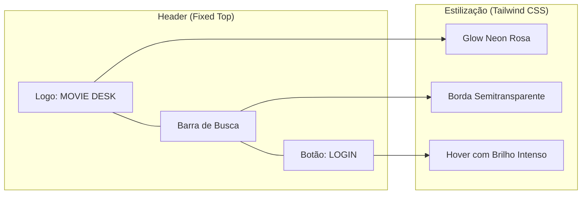

# Identidade Visual e Estrutura do Header

Este documento descreve a identidade visual e a estrutura técnica do componente `Header.tsx`, focado na estética **Fixed Dark Neon**.

## 🎨 Conceito Visual: Cyberpunk Moderno

O projeto utiliza uma estética baseada em contrastes altos, inspirada em interfaces futuristas e neon.

- **Tema Único:** Dark Mode (Preto Profundo).
- **Cor de Destaque:** Rosa Neon / Magenta (#ff2d75).
- **Efeito Principal:** Glassmorphism (vidro embaçado) no fundo do cabeçalho.

## 🗺️ Diagrama de Estrutura do Header



---

## 🔍 Explicação Técnica da Estrutura

### 1. Posicionamento e Efeito Glass

O cabeçalho utiliza a classe `fixed` para permanecer no topo enquanto o usuário rola a página, e a classe customizada `glass` para o efeito de vidro:

```tsx
<header className="fixed top-0 left-0 w-full z-50 glass ...">
```

- **`glass`**: Definido no `index.css`, utiliza `backdrop-filter: blur(15px)` para dar transparência com desfoque ao conteúdo que passa por trás.

### 2. Estilização Neon (Tailwind CSS)

A cor rosa neon é aplicada via variáveis de tema no Tailwind:

- **Sombra/Brilho:** `shadow-neon` cria o brilho característico no texto e botões.
- **Bordas:** `border-neon-pink/20` cria bordas sutis que ganham destaque no foco (`focus:border-neon-pink`).

### 3. Responsividade Portátil

O Header foi planejado para ser compacto em dispositivos móveis seguindo a estratégia **Mobile-First**:

- O texto "MOVIE" do logo é ocultado em telas extra pequenas (`hidden min-[350px]:inline`).
- O botão de Login vira apenas um ícone em telas pequenas para economizar espaço horizontal.

---

## 💡 Resumo de Atributos Fixos

- **Fundo:** `bg-dark-bg/80` (Preto com 80% de opacidade).
- **Borda Inferior:** Rosa neon sutil com transparência.
- **Interatividade:** Focada em transições suaves (`transition-all`) e efeitos de brilho ao passar o mouse.
