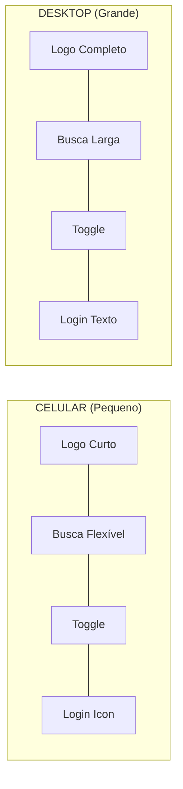

# Fluxo Visual: Responsividade do Header (Mobile-First)

Este documento explica como adaptamos o cabeçalho para que todos os elementos (Logo, Busca, Tema e Login) caibam harmoniosamente tanto em celulares quanto em computadores.

## 📱 Estratégia Mobile-First

No desenvolvimento profissional, usamos o **Mobile-First**: primeiro fazemos caber no menor espaço possível (celular) e depois expandimos para telas maiores.

### 🗺️ Diagrama de Adaptação



---

## 🔍 O que mudamos no código:

### 1. Logo Adaptável

```tsx
<span className="hidden sm:inline">MOVIE</span>
```

- **Ação:** Escondemos a palavra "MOVIE" em telas muito pequenas (abaixo de 640px).
- **Resultado:** O logo vira apenas **DESK**, economizando espaço sem perder a identidade.

### 2. Busca Flexível (Substituindo o Fixo)

```tsx
<div className="flex-1 max-w-[150px] md:max-w-xs relative group mx-2">
```

- **`flex-1`:** Diz para a barra de busca: "pegue o máximo de espaço que sobrar, mas respeite os vizinhos".
- **`max-w-[150px]`:** No mobile, ela não passa de 150px para não empurrar os botões para fora.
- **`md:max-w-xs`:** Em telas maiores, ela volta a ter o tamanho padrão confortável.

### 3. Redução de Margens e Gaps

- Mudamos de `gap-6` (24px) para `gap-2` no mobile e `sm:gap-6` no desktop.
- Isso evita que os elementos batam na borda da tela.

### 4. Botão de Login Inteligente

```tsx
<span className="hidden sm:inline">Login</span>
<User size={18} className="sm:hidden" />
```

- **Ação:** Em celulares, o botão de login vira apenas um **ícone de usuário**. Em computadores, ele volta a exibir a palavra "Login".

---

## 💡 Por que isso é "Padrão Profissional"?

Sites de elite como Netflix e Amazon não tentam espremer tudo; eles **condensam** a informação. O usuário de celular reconhece ícones rapidamente, economizando o precioso espaço horizontal.
